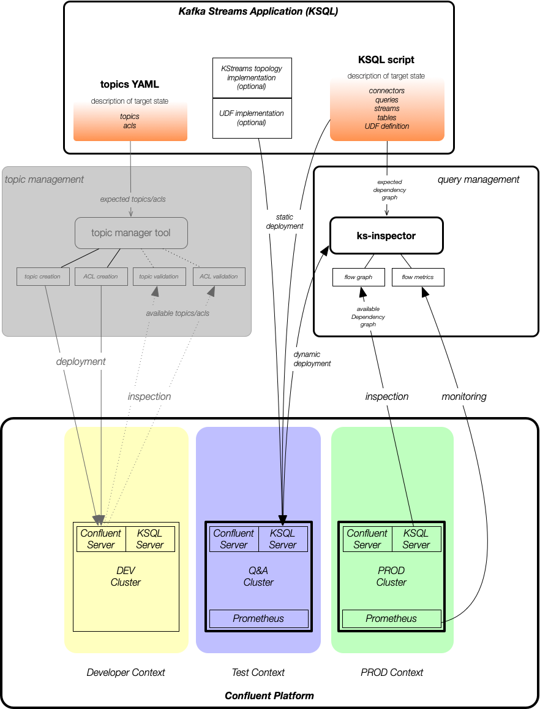

# ks-inspector
A tool which helps the operator and developer to understand dependencies between KSQL queries and KStreams applications.

<a href="https://codeclimate.com/github/kamir/ks-inspector"></a>  [](https://travis-ci.org/kamir/ks-inspector)


## Concept

We define an *application context* in order to provide all required information for an
analysis of a particular *streaming use-case*. 
This also works for for multiple uses cases in a multi-tenant environment.



### How to draw the dependency graph?

The tool produces a dependency graph in the folder `insights` within your working directory.

Using the Graphviz tool we are able to render a dependency network as a PDF file.
```
dot -Tpdf insights/opentsx.ksql.dot -o pdf/opentsx.pdf
```
Source: https://github.com/rakhimov/cppdep/wiki/How-to-view-or-work-with-Graphviz-Dot-files

### How to get the currently deployed queries from KSQL server via REST API?

```
curl -X "POST" "http://localhost:8088/ksql" \
     -H "Content-Type: application/vnd.ksql.v1+json; charset=utf-8" \
     -d $'{
  "ksql": "LIST STREAMS;",
  "streamsProperties": {}
}' > streams.data
```

```
curl -X "POST" "http://localhost:8088/ksql" \
     -H "Content-Type: application/vnd.ksql.v1+json; charset=utf-8" \
     -d $'{
  "ksql": "LIST TABLES;",
  "streamsProperties": {}
}' > tables.data
```

```
curl -X "POST" "http://localhost:8088/ksql" \
     -H "Content-Type: application/vnd.ksql.v1+json; charset=utf-8" \
     -d $'{
  "ksql": "LIST QUERIES;",
  "streamsProperties": {}
}' > queries.data
```

Source: https://rmoff.net/2019/01/17/ksql-rest-api-cheatsheet/
